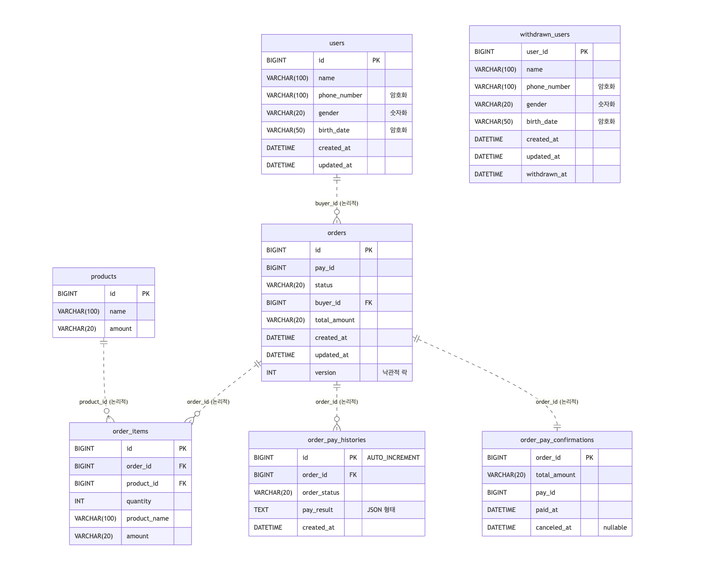

# 주문 시스템

## 📋 목차
1. [서버 구동 방법](#서버-구동-방법)
2. [API 명세](#api-명세)
3. [ERD](#erd)
4. [시스템 설계](#시스템-설계)
5. [고려사항](#고려사항)
6. [향후 개선방안](#-향후-개선방안)

---

## 1. 서버 구동 방법

```bash
java -jar api.jar --spring.profiles.active=dev
```

---

## 2. API 명세

자세한 API 명세는 [API_SPECIFICATION.md](docs/API_SPECIFICATION.md)를 참조하세요.

### 주요 기능
- **회원 관리**: 회원가입, 탈퇴, 탈퇴 철회
- **상품 주문**: 주문 준비, 결제, 주문 취소

### 인증
회원 가입을 제외한 모든 API는 `x-user-id` 헤더를 통한 사용자 인증이 필요합니다. 
* 앞단에 별도의 인증 서버가 존재하여 토큰 검증 등의 인증 절차를 처리한다고 가정합니다.

---

## 3. ERD



---

## 4. 시스템 설계

## 📁 프로젝트 구조

```
payment/
├── api/                    # 외부 인터페이스 계층
│   └── src/main/kotlin/com/cafe/payment/
│       ├── controller/     # REST API 컨트롤러
│       ├── auth/          # 인증 처리
│       └── config/        # 설정
├── service/               # 비즈니스 로직 계층
│   └── src/main/kotlin/com/cafe/payment/
│       ├── user/          # 회원 도메인
│       ├── product/       # 상품 도메인
│       ├── order/         # 주문 도메인
│       └── billing/       # 결제 도메인
├── library/               # 공통 라이브러리
└── docs/                  # 문서
    ├── API_SPECIFICATION.md
    └── images/
        └── erd_image.png
``` 

## 모듈 구조
- **api 모듈**: 외부 요청 처리, 인증 처리 등 외부 인터페이스 담당
- **service 모듈**: 도메인별 비즈니스 로직 담당
- **library 모듈**: 공통 라이브러리


## 도메인 구조
service 모듈은 아래 4개의 도메인으로 구성됩니다:
- `product`: 상품
- `order`: 주문
- `billing`: 결제 / 외부 서버 호출
- `user`: 회원

#### 계층별 의존성
```
┌─────────────────┐
│   Application   │ ◄─── 외부에서 호출 (API, Controller 등)
│   (유즈케이스)    │
└─────────────────┘
         │ │
         │ └─────────────────┐
         ▼                   ▼
┌─────────────────┐    ┌─────────────────┐
│     Domain      │    │   Repository    │
│  (순수 모델)      │ ◄──│   (데이터접근)    │
└─────────────────┘    └─────────────────┘
         ▲                   │
         │                   ▼
         └─────────────── Database/JPA
```

---

## 5. 고려사항

### 🔍 가정한 것
- 결제
  - 결제 서버는 멱등성을 보장합니다.
    - 동일한 결제 요청을 여러 번 보내도 중복 결제가 발생하지 않습니다
    - 네트워크 오류로 인한 재시도 시에도 안전하게 처리됩니다
  - (주문 준비가 필요한 이유) 결제 지연으로 인한 결제 재시도 처리를 위해 PayId를 발급받습니다.
    - 결제 지연 시 사용자는 주문 실패로 인식하지만, 실제로는 결제가 완료될 수 있습니다
    - 이 경우 환불 처리를 위해서는 PayId가 필요하므로, 미리 발급받아 저장해둡니다
- 상품
  - 상품의 재고는 무한합니다.
  - 상품의 데이터는 모두 유효한 값(상품명, 가격 등)을 가지고 있습니다.
  - 상품의 가격은 모두 원화입니다.
---
## 6. 향후 개선방안

- **전역 에러 핸들링**: 커스텀 예외 활용 / 전역 예외 처리 및 통일된 에러 응답 포맷 구현
- **결제 상태 동기화**: 결제 지연 시 백그라운드 상태 확인 및 자동 환불 처리 로직 추가
- **낙관락 충돌 처리**: Order 상태와 실제 결제 간 데이터 정합성 검증 및 동기화 로직 구현

---
